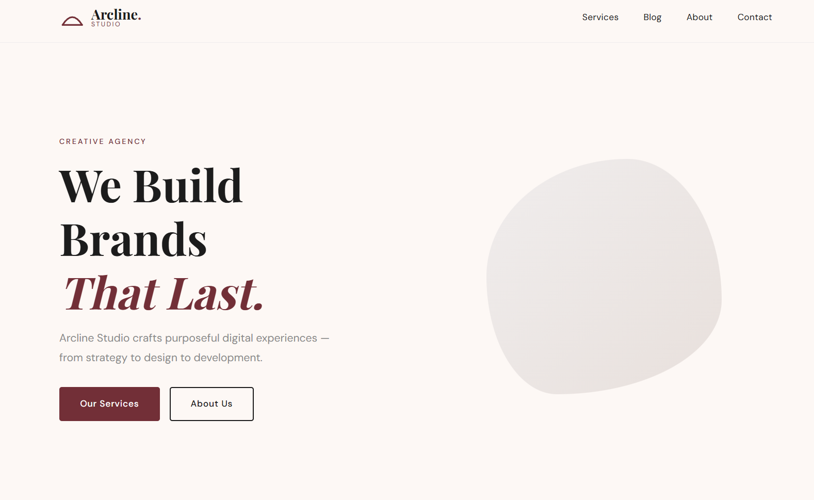

# Arcline Studio — WordPress Theme

A clean, elegant custom WordPress theme built from scratch for Arcline Studio creative agency. No page builders, no CSS frameworks — pure PHP and mobile-first CSS.



## Features

- Custom Post Type: **Services** (with ACF icon and description fields)
- Custom navigation menus (Primary + Footer)
- Mobile-first responsive CSS — no frameworks
- WordPress template hierarchy implemented correctly
- The Loop used across all templates
- Sticky header with animated mobile nav drawer
- Morphing hero shape animation
- Google Fonts: Playfair Display + DM Sans
- Proper script/style enqueuing via `functions.php`
- Widget-ready sidebar area

## Theme Files

| File | Purpose |
|---|---|
| `style.css` | Theme registration |
| `functions.php` | Setup, enqueue, CPT, menus, widgets |
| `index.php` | Fallback template |
| `home.php` | Blog posts listing |
| `header.php` | Site header + navigation |
| `footer.php` | Site footer |
| `front-page.php` | Homepage template |
| `single.php` | Single blog post |
| `page.php` | Static pages |
| `archive.php` | Category/tag archives |
| `404.php` | Error page |
| `sidebar.php` | Widget area |

## Requirements

- WordPress 6.0+
- PHP 8.0+
- [Advanced Custom Fields (Free)](https://wordpress.org/plugins/advanced-custom-fields/)

## Installation

1. Clone the repo into your WordPress themes folder:
```bash
git clone https://github.com/ItsUgesh/arcline-wp-theme.git
```
2. Go to **WP Admin → Appearance → Themes**
3. Activate **Arcline Studio**
4. Install & activate the **ACF** plugin
5. Go to **WP Admin → Custom Fields** — import or recreate the Services field group
6. Go to **Settings → Reading** — set Homepage and Posts page
7. Go to **Appearance → Menus** — assign Primary and Footer menus

## Color Palette

| Name | Hex |
|---|---|
| Warm White | `#FDF8F5` |
| Deep Burgundy | `#722F37` |
| Charcoal | `#1C1C1C` |
| Light Gray | `#F0EDED` |
| Mid Gray | `#8A8A8A` |

## Typography

- **Headings:** Playfair Display
- **Body:** DM Sans

## Author

Built by [Ugesh](https://ugeshsimkhada.com.np)

## License

[GNU General Public License v2](https://www.gnu.org/licenses/gpl-2.0.html)